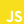
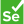

<h1 align="center"><b>Hi , I'm Julian Pietracz</b></h1>

 

## <b>About me</b>

- 👨‍💻 Passionate developer at night
- 🚴 Cyclist by day
- 🌱 Currently honing my skills in web development
- 🌍 Personal website: [link](https://www.icegif.com/wp-content/uploads/2023/01/icegif-162.gif)

 

## <b> Skills</b>

**Front-End Development**:
   

  
  
  
  
  

  

  

**Back-End Development**:
   
    
  
  

**Testing**:
   

  
  

**Cloud Hosting**:
 

**Extras**:
 

## <b> Contact me!</b>
 

<ul>

<li>

</li>

 

<li>

</li>

 

<li>

</li>
	
</ul>

 